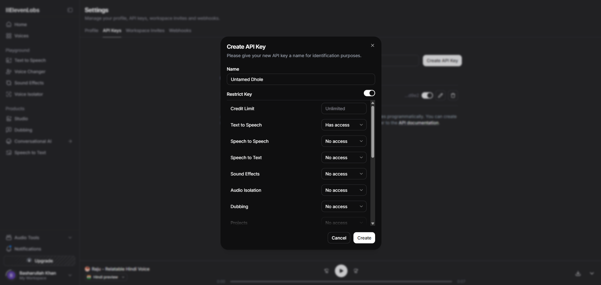
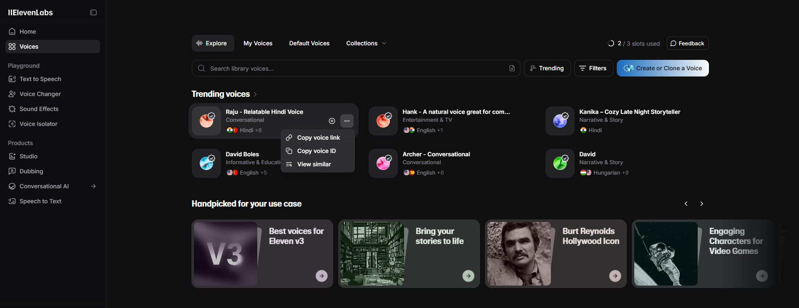
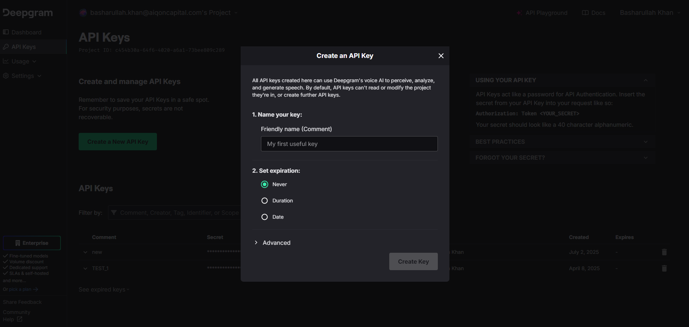

# Accent Virtual Agent

A sophisticated AI-powered voice agent for debt collection calls, built with real-time speech recognition, natural language processing, and text-to-speech capabilities. This application provides a professional and compliant voice interface for engaging with debtors, verifying identities, and discussing repayment options.

## 🎯 Overview

The Accent Virtual Agent is designed to handle outbound debt collection calls with a focus on compliance, professionalism, and effective communication. The agent, named "Ali," represents Aiqon (a debt collection company) and follows structured call flows while handling various objections and scenarios that may arise during debt collection conversations.

## ✨ Features

### Core Capabilities
- **Real-time Voice Communication**: WebRTC-based audio streaming for seamless voice interactions
- **Speech-to-Text**: Deepgram-powered real-time transcription with smart formatting
- **Natural Language Processing**: Azure OpenAI GPT-4 integration for intelligent conversation handling
- **Text-to-Speech**: ElevenLabs voice synthesis with natural-sounding speech
- **Voice Activity Detection**: Silero VAD for efficient audio processing
- **Email Integration**: Automated email sending functionality for follow-up communications

### Professional Features
- **Compliant Call Flow**: Structured conversation flow following debt collection regulations
- **Identity Verification**: Secure verification processes following PDPA guidelines
- **Objection Handling**: Comprehensive scripts for handling common debtor objections
- **Payment Plan Discussion**: Automated assistance with repayment option discussions
- **Call Recording Compliance**: Built-in compliance features for call recording notifications

## 🏗️ Architecture

The application is built using a modern microservices architecture with the following components:

- **FastAPI Backend**: RESTful API server handling WebRTC connections and pipeline management
- **WebRTC Transport**: Real-time audio streaming between client and server
- **Pipeline Processing**: Multi-stage audio processing pipeline (STT → LLM → TTS)
- **Azure Services**: OpenAI GPT-4 for conversation intelligence
- **Deepgram**: High-accuracy speech recognition
- **ElevenLabs**: Natural-sounding text-to-speech synthesis

## 📋 Prerequisites

Before running this application, ensure you have:

- Python 3.8 or higher
- Valid API keys for the following services:
  - Azure OpenAI (GPT-4)
  - Deepgram (Speech-to-Text)
  - ElevenLabs (Text-to-Speech)
  - Azure Communication Services (Email)

## 🚀 Installation

1. **Clone the repository**
   ```bash
   git clone <repository-url>
   cd "Accent Virtual Agent"
   ```

2. **Install dependencies**
   ```bash
   pip install -r requirements.txt
   ```

3. **Set up environment variables**
   Create a `.env` file in the root directory with the following variables:
   ```env
   # Azure OpenAI Configuration
   AZURE_OPENAI_API_KEY=your_azure_openai_api_key
   AZURE_OPENAI_ENDPOINT=your_azure_openai_endpoint

   # Deepgram Configuration
   DEEPGRAM_API_KEY=your_deepgram_api_key

   # ElevenLabs Configuration
   ELEVENLABS_API_KEY=your_elevenlabs_api_key
   ELEVENLABS_VOICE_ID=your_elevenlabs_voice_id

   # Azure Communication Services (Email)
   ACS_CONNECTION_STRING=your_acs_connection_string
   SENDER_ADDRESS=your_sender_email@domain.com
   RECIPIENT_ADDRESS=your_recipient_email@domain.com
   ```

   ## 📝 ElevenLabs Setup Guide

   ElevenLabs provides high-quality text-to-speech synthesis. Follow these detailed steps to set up your ElevenLabs account and obtain the required credentials:

   ### Step 1: Create ElevenLabs Account
   1. Visit [ElevenLabs.io](https://elevenlabs.io)
   2. Click "Sign Up" and create a free account
   3. Verify your email address
   4. Complete your profile setup

   ### Step 2: Get Your API Key
   1. Log in to your ElevenLabs dashboard
   2. Navigate to your profile settings (usually in the top-right corner)
   3. Look for the "API Key" section
   4. Click "Copy" to copy your API key
   5. **Important**: Keep this key secure and never share it publicly

   

   ### Step 3: Choose Your Voice
   1. Go to the "Voice Library" section in your dashboard
   2. Browse through available voices (free tier includes several options)
   3. Listen to voice samples to find one that matches your needs
   4. Consider factors like:
      - **Language**: Ensure the voice supports your target language
      - **Tone**: Professional, friendly, or authoritative
      - **Gender**: Male or female voice preference
      - **Accent**: Regional accent preferences

   ### Step 4: Get Your Voice ID
   1. Select your preferred voice from the Voice Library
   2. Click on the voice to open its details
   3. Look for the "Voice ID" field (usually a long string of characters)
   4. Copy the Voice ID
   5. The Voice ID I am using is "NpVSXJvYSdIbjOaMbShj"

   

   ### Step 5: Test Your Setup
   1. Add your API key and Voice ID to the `.env` file
   2. Run the application
   3. Test the voice synthesis to ensure it's working correctly

   ### Voice Configuration Tips
   - **Free Tier Limits**: Free accounts have monthly character limits
   - **Voice Cloning**: You can clone your own voice (requires paid plan)
   - **Custom Voices**: Create custom voices for specific use cases
   - **Voice Settings**: Adjust stability, similarity, and style in the code

   ### Troubleshooting ElevenLabs
   - **API Key Invalid**: Ensure you've copied the full key without extra spaces
   - **Voice ID Not Found**: Verify the Voice ID exists in your account
   - **Rate Limits**: Free tier has usage limits; consider upgrading for production use
   - **Audio Quality**: Adjust stability and similarity settings for better quality

   ## 📝 Deepgram Setup Guide

   Deepgram provides real-time speech recognition capabilities. Follow these detailed steps to set up your Deepgram account and obtain the required API key:

   ### Step 1: Create Deepgram Account
   1. Visit [Deepgram.com](https://deepgram.com)
   2. Click "Sign Up" and create a free account
   3. Verify your email address
   4. Complete your profile setup

   ### Step 2: Get Your API Key
   1. Log in to your Deepgram dashboard
   2. Navigate to the "API Keys" section in your account settings
   3. Click "Create API Key" to generate a new key
   4. Give your API key a descriptive name (e.g., "Accent Virtual Agent")
   5. Copy the generated API key
   6. **Important**: Keep this key secure and never share it publicly

   

   ### Step 3: Configure Speech Recognition Settings
   The application uses the following Deepgram settings by default:
   - **Model**: `nova-2-general` (high-accuracy model)
   - **Language**: `en-US` (English, US)
   - **Smart Formatting**: Enabled for better text formatting
   - **Voice Activity Detection**: Enabled for efficient processing

   ### Step 4: Test Your Setup
   1. Add your Deepgram API key to the `.env` file
   2. Run the application
   3. Test speech recognition by speaking into the microphone
   4. Verify that your speech is accurately transcribed

   ### Deepgram Features
   - **Real-time Transcription**: Instant speech-to-text conversion
   - **Multiple Languages**: Support for various languages and accents
   - **Custom Models**: Train custom models for specific domains
   - **WebSocket Support**: Real-time streaming capabilities
   - **High Accuracy**: Advanced AI models for better recognition

   ### Troubleshooting Deepgram
   - **API Key Invalid**: Ensure you've copied the full key without extra spaces
   - **No Audio Input**: Check microphone permissions and device settings
   - **Poor Recognition**: Ensure clear audio input and minimal background noise
   - **Rate Limits**: Free tier has usage limits; consider upgrading for production use
   - **Language Issues**: Verify the language setting matches your speech

   ## 📝 Azure OpenAI Setup Guide

   Azure OpenAI provides access to advanced language models like GPT-4. Follow these detailed steps to set up your Azure OpenAI service and obtain the required credentials:

   ### Step 1: Azure Account Setup
   1. Visit [Azure Portal](https://portal.azure.com)
   2. Sign in with your Microsoft account or create a new one
   3. Ensure you have an active Azure subscription
   4. If you don't have a subscription, you can create a free account with credits

   ### Step 2: Create Azure OpenAI Resource
   1. In the Azure Portal, click "Create a resource"
   2. Search for "Azure OpenAI" and select it
   3. Click "Create" to start the deployment process
   4. Fill in the required information:
      - **Subscription**: Select your Azure subscription
      - **Resource Group**: Create new or use existing
      - **Region**: Choose a region close to your users
      - **Name**: Give your resource a unique name
      - **Pricing Tier**: Select appropriate tier (Standard S0 recommended)
   5. Click "Review + create" and then "Create"
   6. Wait for deployment to complete (usually 5-10 minutes)

   ### Step 3: Get Your API Key
   1. Navigate to your Azure OpenAI resource in the portal
   2. In the left sidebar, click "Keys and Endpoint"
   3. You'll see two keys (Key 1 and Key 2) - you can use either one
   4. Click the "Copy" button next to the key you want to use
   5. **Important**: Keep this key secure and never share it publicly

   ### Step 4: Get Your Endpoint URL
   1. In the same "Keys and Endpoint" section
   2. Copy the "Endpoint" URL (it looks like: `https://your-resource-name.openai.azure.com/`)
   3. This is your Azure OpenAI endpoint

   ### Step 5: Deploy a Model
   1. In your Azure OpenAI resource, go to "Model deployments"
   2. Click "Create" to deploy a new model
   3. Select "GPT-4" or "GPT-4o" as your model
   4. Give your deployment a name (e.g., "gpt-4o")
   5. Click "Create" and wait for deployment to complete

   ### Step 6: Test Your Setup
   1. Add your API key and endpoint to the `.env` file
   2. Ensure the model name in your code matches your deployment name
   3. Run the application
   4. Test the conversation flow to verify the AI responses

   ### Azure OpenAI Features
   - **GPT-4 Integration**: Access to the latest GPT-4 and GPT-4o models
   - **Enterprise Security**: Built-in security and compliance features
   - **Regional Deployment**: Deploy in your preferred Azure region
   - **Usage Monitoring**: Track API usage and costs
   - **Custom Models**: Fine-tune models for specific use cases

   ### Configuration Details
   The application uses the following Azure OpenAI settings:
   - **Model**: `gpt-4o` (as specified in the code)
   - **API Version**: Latest stable version
   - **Temperature**: Default (varies based on conversation context)
   - **Max Tokens**: Configured for conversation length

   ### Troubleshooting Azure OpenAI
   - **API Key Invalid**: Ensure you've copied the full key without extra spaces
   - **Endpoint Error**: Verify the endpoint URL is correct and includes the trailing slash
   - **Model Not Found**: Ensure the model name matches your deployment name exactly
   - **Rate Limits**: Check your Azure OpenAI quota and usage limits
   - **Region Issues**: Ensure your endpoint region matches your resource location
   - **Authentication Errors**: Verify your API key has the correct permissions

   ### Cost Management
   - **Free Tier**: Azure OpenAI doesn't have a free tier, but you can start with small amounts
   - **Usage Monitoring**: Monitor your usage in the Azure Portal
   - **Cost Optimization**: Use appropriate model sizes for your use case
   - **Quota Management**: Set up spending limits to control costs

   ## 📝 Azure Communication Services (Email) Setup Guide

   Azure Communication Services provides reliable email delivery capabilities. Follow these detailed steps to set up your Azure Communication Services for email functionality:

   ### Step 1: Azure Account Setup
   1. Visit [Azure Portal](https://portal.azure.com)
   2. Sign in with your Microsoft account or create a new one
   3. Ensure you have an active Azure subscription
   4. If you don't have a subscription, you can create a free account with credits

   ### Step 2: Create Communication Services Resource
   1. In the Azure Portal, click "Create a resource"
   2. Search for "Azure Communication Services" and select it
   3. Click "Create" to start the deployment process
   4. Fill in the required information:
      - **Subscription**: Select your Azure subscription
      - **Resource Group**: Create new or use existing
      - **Region**: Choose a region close to your users
      - **Name**: Give your resource a unique name
      - **Data Location**: Select appropriate data residency
   5. Click "Review + create" and then "Create"
   6. Wait for deployment to complete (usually 3-5 minutes)

   ### Step 3: Configure Email Domain
   1. Navigate to your Communication Services resource
   2. In the left sidebar, click "Provision domains"
   3. Click "Add domain" to add your email domain
   4. Enter your domain name (e.g., `yourdomain.com`)
   5. Follow the DNS verification steps:
      - Add the provided TXT record to your domain's DNS
      - Wait for DNS propagation (can take up to 24 hours)
      - Click "Verify" once DNS is updated
   6. Once verified, your domain will be ready for sending emails

   ### Step 4: Get Your Connection String
   1. In your Communication Services resource, go to "Keys"
   2. You'll see two connection strings (Primary and Secondary)
   3. Click "Copy" next to the Primary connection string
   4. **Important**: Keep this connection string secure and never share it publicly

   ### Step 5: Configure Sender Address
   1. In your Communication Services resource, go to "Provision domains"
   2. Select your verified domain
   3. Click "Add sender address"
   4. Enter your sender email address (e.g., `noreply@yourdomain.com`)
   5. Complete the verification process if required

   ### Step 6: Set Up Recipient Address
   1. Decide on your recipient email address
   2. This can be any valid email address where you want to receive emails
   3. Ensure the recipient address is active and can receive emails

   ### Step 7: Test Your Email Setup
   1. Add your connection string and email addresses to the `.env` file
   2. Run the application
   3. Test the email functionality by triggering an email send
   4. Verify that emails are delivered successfully

   ### Azure Communication Services Features
   - **Reliable Delivery**: High deliverability rates with built-in retry logic
   - **Domain Verification**: Secure email sending from your own domain
   - **Usage Analytics**: Track email delivery and engagement metrics
   - **Compliance**: Built-in compliance with email regulations
   - **Scalability**: Handle high-volume email sending

   ### Configuration Details
   The application uses the following email settings:
   - **Service**: Azure Communication Services Email
   - **Authentication**: Connection string-based authentication
   - **Polling**: Automatic status checking for email delivery
   - **Timeout**: 18-second timeout for email operations

   ### Email Configuration in Code
   ```python
   # Example email configuration from email_tool.py
   message = {
       "senderAddress": os.getenv("SENDER_ADDRESS"),
       "recipients": {
           "to": [{"address": os.getenv("RECIPIENT_ADDRESS")}],
       },
       "content": {
           "subject": subject,
           "plainText": plain_text_body,
       } 
   }
   ```

   ### Troubleshooting Azure Communication Services
   - **Connection String Invalid**: Ensure you've copied the full connection string
   - **Domain Not Verified**: Complete DNS verification before sending emails
   - **Sender Address Issues**: Verify your sender address is properly configured
   - **Email Not Delivered**: Check recipient address and spam filters
   - **Rate Limits**: Monitor your email sending quotas
   - **Authentication Errors**: Verify your connection string has correct permissions

   ### Email Best Practices
   - **Sender Reputation**: Use a consistent sender address
   - **Content Quality**: Ensure email content follows best practices
   - **Recipient Management**: Maintain clean recipient lists
   - **Monitoring**: Regularly check delivery reports
   - **Compliance**: Follow email regulations (CAN-SPAM, GDPR, etc.)

   ### Cost Management
   - **Free Tier**: Azure Communication Services offers free tier with limits
   - **Usage Monitoring**: Track email usage in the Azure Portal
   - **Cost Optimization**: Monitor and optimize email sending patterns
   - **Quota Management**: Set up spending limits to control costs


## 🎮 Usage

### Starting the Application

1. **Run the main application**
   ```bash
   python main_v2.py
   ```

2. **Access the web interface**
   - Open your browser and navigate to `http://localhost:8000`
   - The application will redirect you to the WebRTC client interface

### Web Interface

The application provides a web-based interface where you can:
- Initiate voice calls with the AI agent
- View real-time transcription of conversations
- Monitor call status and connection quality
- Access call history and logs

### API Endpoints

- `GET /`: Redirects to the web client interface
- `POST /api/offer`: Handles WebRTC connection offers and establishes peer connections

## 🔧 Configuration

### Voice Settings

The TTS (Text-to-Speech) settings can be configured in `main_v2.py`:

```python
tts = ElevenLabsTTSService(
    api_key=os.getenv("ELEVENLABS_API_KEY"),
    voice_id=os.getenv("ELEVENLABS_VOICE_ID"),
    params=ElevenLabsTTSService.InputParams(
        language=ElevenLabsLanguage.EN,
        stability=0.7,        # Voice stability (0-1)
        similarity_boost=0.8, # Voice similarity (0-1)
        style=0.5,           # Voice style (0-1)
        use_speaker_boost=True,
        speed=0.8            # Speech speed (0-1)
    )
)
```

### Speech Recognition Settings

Deepgram STT settings can be modified in `main_v2.py`:

```python
stt = DeepgramSTTService(
    api_key=os.getenv("DEEPGRAM_API_KEY"),
    live_options=LiveOptions(
        model="nova-2-general",  # Speech recognition model
        language="en-US",        # Language setting
        smart_format=True,       # Enable smart formatting
        vad_events=True          # Enable voice activity detection
    )
)
```

## 📞 Call Flow

The application follows a structured call flow:

1. **Greeting & Identification**: Agent introduces themselves and requests to speak with the debtor
2. **Verification Process**: Confirms identity using IC number or date of birth
3. **Discussion**: Explains the purpose of the call and discusses payment options
4. **Payment Plan Selection**: Offers various repayment plans
5. **Closing**: Handles follow-up arrangements and call conclusion

### Objection Handling

The system includes comprehensive scripts for handling common objections:
- Wrong number claims
- Identity verification refusals
- Fraud accusations
- Settlement claims
- Account ownership denials
- Harassment complaints
- Financial hardship claims

## 🔒 Compliance & Security

- **PDPA Compliance**: Follows Personal Data Protection Act guidelines
- **Identity Verification**: Secure verification processes
- **Call Recording**: Proper notification and consent handling
- **Data Protection**: Secure handling of sensitive information

## 🛠️ Development

### Project Structure

```
Accent Virtual Agent/
├── main_v2.py          # Main application entry point
├── email_tool.py       # Email sending functionality
├── utils.py           # System message and utilities
├── requirements.txt   # Python dependencies
└── README.md         # This file
```

### Key Components

- **`main_v2.py`**: FastAPI application with WebRTC handling and pipeline setup
- **`email_tool.py`**: Azure Communication Services integration for email functionality
- **`utils.py`**: Contains the system message defining the agent's personality and call flow

## 🐛 Troubleshooting

### Common Issues

1. **WebRTC Connection Issues**
   - Ensure your browser supports WebRTC
   - Check firewall settings for WebRTC traffic
   - Verify STUN server connectivity

2. **Audio Quality Issues**
   - Check microphone permissions in the browser
   - Ensure stable internet connection
   - Verify audio device settings

3. **API Key Errors**
   - Verify all environment variables are set correctly
   - Check API key validity and quotas
   - Ensure proper service endpoints

### Logs

The application uses Loguru for logging. Check the console output for detailed logs and error messages.

## 📄 License

[Add your license information here]

## 🤝 Contributing

[Add contribution guidelines here]

## 📞 Support

For support and questions, please contact [your contact information].

---

**Note**: This application is designed for professional debt collection use. Ensure compliance with all applicable laws and regulations in your jurisdiction before deployment. 